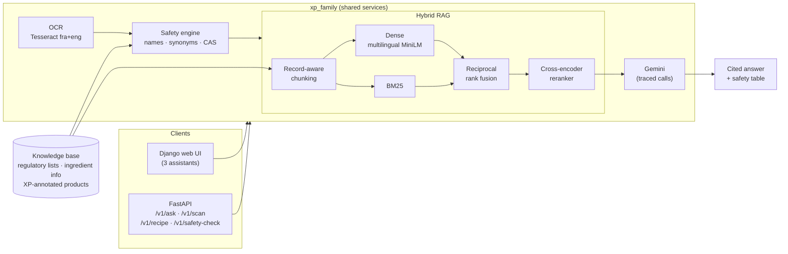

# XP Family Support

**Multimodal RAG for Xeroderma Pigmentosum patients and their families:** scan a cosmetic
label, find out which ingredients are unsafe for XP skin, ask questions, and get XP-safe
homemade recipes. Every answer is grounded in a curated knowledge base and cites its
sources.

[](https://github.com/sarralch/xp-family-multimodal-ai/actions/workflows/ci.yml)

[](https://doi.org/10.1109/ADACIS65663.2025.11436247)

> Xeroderma Pigmentosum (XP) is a rare genetic disorder in which the skin cannot repair UV
> damage. For XP families, one photosensitising ingredient in a cream is a real risk. This
> project turns regulatory lists and ingredient science into answers they can act on.

---

## Overview

The platform has three assistants and one shared safety engine:

| Assistant | Input | What it does |
|---|---|---|
| **1. Label scanner** | Photo of a product label | Reads the ingredient list with OCR, screens every ingredient, then explains the risks with RAG |
| **2. Ingredient Q&A** | A free-form question (typed or spoken) | Hybrid retrieval over regulatory and scientific records, with a cited answer from Gemini |
| **3. XP-safe recipes** | Ingredients you have, plus a product type | Refuses if any ingredient is unsuitable; otherwise generates a recipe grounded in XP-annotated products |

The **safety engine** is deterministic (no LLM). It matches names, INCI synonyms and CAS
numbers without regard to accents or case, and gives each ingredient one of four statuses:
**banned**, **caution**, **not flagged** (known, with no XP warning in the data) or
**unknown**. It never declares an ingredient "safe", and unknown ingredients are always
shown to the user.

## Architecture



<p align="center"></p>

## Features

- **Hybrid retrieval.** BM25 finds exact identifiers such as INCI names and CAS numbers
  like `106-88-7`. Multilingual embeddings handle free-form French or English questions.
  Reciprocal rank fusion merges the two rankings, and a cross-encoder reranks the top 20
  candidates.
- **Record-aware chunking.** One substance becomes one chunk. Long records are split at
  sentence boundaries, and each chunk carries a title header so it still makes sense on
  its own.
- **Grounded prompts.** Answers must cite `[1]`, `[2]` and say when the context is
  insufficient instead of guessing.
- **Deterministic safety screening** before any generation. Recipes are refused if any
  ingredient is banned or flagged for XP.
- **Accessible UI.** Results render in an `aria-live` region with a per-ingredient table.
  Voice input and read-aloud use the browser's speech APIs.
- **Observability.** Structured JSON logs, a trace ID per request (`X-Trace-Id`), and one
  `llm_call` event per Gemini call with latency and token counts.
- **Typed configuration** with pydantic-settings. Non-secret defaults are in
  `configs/default.env`; secrets go in `.env`.

### What changed in v2

| v1 | v2 |
|---|---|
| Any ingredient missing from the banned list counted as **safe** | Four explicit statuses, none of which claims safety; **unknown** is always shown |
| Dense-only retrieval (English MiniLM) over whole records | BM25 + multilingual dense + RRF + cross-encoder rerank, with record-aware chunks |
| Assistant 3 read the raw product export: the ingredient string was joined letter by letter and every recipe was titled "Recette inconnue" | Reads the XP-annotated product file |
| Per-request BERTScore and Hit@k compared the answer with the document just retrieved, so Hit@k was always 1 | Offline benchmark on independent queries (below) |
| Indexes and models built at import time, so one missing file crashed the whole site | Lazy, shared services; a missing key or data file returns HTTP 503 |
| Three copies of a deprecated `google.generativeai` wrapper; FAISS pickles loaded with `allow_dangerous_deserialization` | One traced `google-genai` client; embeddings cached as `.npy` |
| Hardcoded Windows Tesseract path, `DEBUG=True`, no tests | Config from environment, Docker, 37 tests, CI |

## Quick start

### Docker (one command)

```bash
cp .env.example .env          # add GEMINI_API_KEY and DJANGO_SECRET_KEY
docker compose up --build
```

- API and Swagger UI: http://localhost:8000/docs
- Web UI: http://localhost:8001

Without the private datasets, you can run on the bundled synthetic sample by adding
`DATA_DIR=/app/data/sample` to `.env`.

### Local (uv)

```bash
uv sync --extra ml --extra ocr --extra web --extra dev
cp .env.example .env
uv run uvicorn xp_family.api.main:app --reload             # API on :8000
cd web && uv run python manage.py runserver 8001           # UI on :8001
```

OCR also needs the [Tesseract](https://tesseract-ocr.github.io/) binary. Docker installs
it for you. Elsewhere, set `TESSERACT_CMD` if Tesseract isn't on your `PATH`.

### API example

The response below is real output on the project dataset:

```bash
curl -X POST localhost:8000/v1/safety-check      -H 'content-type: application/json'      -d '{"ingredients": "Aqua, Benzophenone-3, Aloe Vera, Retinol, Parfum"}'
```

```json
{"verdicts": [
   {"ingredient": "Aqua", "status": "unknown"},
   {"ingredient": "Benzophenone-3", "status": "banned", "matched": "Benzophenones",
    "effects": ["Perturbateur endocrinien", "Allergène"]},
   {"ingredient": "Aloe Vera", "status": "not_flagged", "matched": "aloe vera"},
   {"ingredient": "Retinol", "status": "not_flagged", "matched": "retinol"},
   {"ingredient": "Parfum", "status": "unknown"}],
 "summary": {"banned": 1, "caution": 0, "not_flagged": 2, "unknown": 2}}
```

Retinol comes back `not_flagged` rather than `caution` because the dataset has no XP
warning for it, even though it is photosensitising. This is exactly why the engine never
says "safe" (see [Limitations](#limitations)).

## Evaluation

### Retrieval

Known-item retrieval on the project datasets: 1744 records, 285 queries (name 60, synonym 45, cas 60, description 60, product 60); seed 13.

| System | Hit@1 | Hit@3 | MRR@10 | Hit@3 name | Hit@3 synonym | Hit@3 cas | Hit@3 description | Hit@3 product | p50 latency |
|---|---:|---:|---:|---:|---:|---:|---:|---:|---:|
| v1: dense MiniLM-L6 (EN), whole records | 0.46 | 0.55 | 0.52 | 0.93 | 0.82 | 0.05 | 0.18 | 0.85 | 124 ms |
| BM25 | 0.68 | 0.75 | 0.74 | 0.98 | 0.87 | 0.10 | 0.85 | 1.00 | 3 ms |
| Dense multilingual, chunked | 0.32 | 0.36 | 0.36 | 0.22 | 0.44 | 0.03 | 0.15 | 1.00 | 128 ms |
| Hybrid (BM25 + dense, RRF) | 0.68 | 0.81 | 0.75 | 1.00 | 0.96 | 0.53 | 0.60 | 1.00 | 128 ms |
| Hybrid + cross-encoder rerank | 0.68 | 0.85 | 0.77 | 1.00 | 0.82 | 0.85 | 0.70 | 0.88 | 856 ms |

**What the numbers say:**

- **v2 (hybrid + rerank) against v1:** Hit@3 rises from **0.55 to 0.85** and MRR@10 from
  **0.52 to 0.77**. The largest gain is on CAS-number queries, from 0.05 to 0.85. v1's
  dense-only search effectively could not find records by identifier.
- **Fusion is what matters.** The multilingual embedding model on its own does worse than
  v1 (Hit@3 0.36). It only adds value combined with BM25, which is why v2 is hybrid.
- **The reranker has a cost.** It lifts CAS and description queries but slightly lowers
  synonym and product queries, and it adds about 0.7 s per query on CPU. Set
  `USE_RERANKER=false` to trade a little recall for speed.
- **Caveat:** the queries come from templates, and the description queries share wording
  with the source text. That favours lexical matching, and BM25 alone scores 0.85 on
  them. Treat this as a regression benchmark for retrieval changes, not as a measure of
  real user questions. The RAGAS evaluation below uses free-form questions.

Reproduce with `python eval/retrieval_eval.py`. No API key is needed. The queries are
generated from the records themselves, and each query type tests a different retrieval
skill: exact names, synonyms, CAS identifiers, semantic descriptions with the ingredient
name hidden, and product lookups.

### End-to-end (RAGAS)

*Not run yet.* It needs a Gemini API key and a reference Q&A set on the private data.
The table will appear here after the first run.

`eval/ragas_eval.py` scores **faithfulness**, **answer relevancy**, **context precision**
and **context recall**, with Gemini as the judge. It compares v1-style retrieval with the
v2 pipeline, using the same LLM and prompt for both, so any difference comes from
retrieval alone.

## Demo

<!-- Screenshots: add images to assets/ and reference them here. -->
| Label scanner | Ingredient Q&A | XP-safe recipe |
|---|---|---|
| *screenshot coming soon* | *screenshot coming soon* | *screenshot coming soon* |

## Project structure

```
src/xp_family/
  config.py          typed settings (pydantic-settings)
  observability.py   structured logging, request trace IDs, traced spans
  llm.py             Gemini client (google-genai) + offline EchoLLM for tests
  rag/               documents, chunking, BM25/dense/hybrid retrieval, reranker, pipeline
  safety.py          deterministic XP ingredient screening
  ocr.py             Tesseract OCR with preprocessing
  uv.py              UV-safe appointment slot selection (for the upcoming scheduler app)
  services.py        lazy wiring shared by API and UI
  api/main.py        FastAPI app
web/                 Django UI (assistants 1-3)
configs/             committed non-secret defaults
data/                private datasets (git-ignored) + synthetic sample/
eval/                retrieval benchmark and RAGAS evaluation
tests/               offline test suite (no API key, no model downloads)
```

## Limitations

- **Coverage of the safety data.** The banned list has 92 entries and the
  ingredient-information file has 248. Common INCI names such as *Aqua*, *Parfum* and
  *Glycerin* are not in either file, so they come back `unknown`. In the ingredient file,
  every entry is marked `safe_for_xp: true`, including photosensitising ingredients such
  as retinol. That flag therefore cannot support a safety claim, and the engine reports
  `not_flagged` instead. Adding explicit XP cautions, for photosensitisers in particular,
  is the most valuable next data step.
- **Gaps in the regulatory lists.** For example, *hydroquinone* is in neither the banned
  list nor the regulatory file. It only appears inside other ingredients' descriptions, so
  the screener reports it as `unknown`, and the Q&A assistant has little to ground an
  answer on.
- **OCR** quality depends on the photo. Curved or glossy packaging reduces accuracy.
  Preprocessing (grayscale and auto-contrast) helps, but check what was extracted.

## Data and privacy

The curated datasets (regulatory substance lists, ingredient information, XP-annotated
products) are **not published**. [`data/README.md`](data/README.md) documents their
schemas. `data/sample/` holds a synthetic stand-in that tests and CI run against.

> **Medical disclaimer:** this is a research prototype. Its output is educational and does
> not replace the advice of a dermatologist.

## Authors

- **Sarra Lachheb**: [@sarralch](https://github.com/sarralch)
- **Mohamed Iyed Lagha**: [@mohamediyedlagha](https://github.com/mohamediyedlagha)

## Publication

This repository accompanies:

> S. Lachheb, M. I. Lagha and M. H. Riahi, "Development and Evaluation of a Specialized
> Retrieval-Augmented Generation System for Cosmetic Product Safety Assessment in Xeroderma
> Pigmentosum Patients," *2025 IEEE International Conference on Advances in Data-Driven
> Analytics And Intelligent Systems (ADACIS)*, 2025, pp. 1–6.
> DOI: [10.1109/ADACIS65663.2025.11436247](https://doi.org/10.1109/ADACIS65663.2025.11436247)

```bibtex
@inproceedings{lachheb2025xprag,
  author    = {Lachheb, Sarra and Lagha, Mohamed Iyed and Riahi, Mohamed H{\'e}di},
  title     = {Development and Evaluation of a Specialized Retrieval-Augmented Generation
               System for Cosmetic Product Safety Assessment in Xeroderma Pigmentosum Patients},
  booktitle = {2025 IEEE International Conference on Advances in Data-Driven Analytics
               And Intelligent Systems (ADACIS)},
  year      = {2025},
  pages     = {1--6},
  publisher = {IEEE},
  doi       = {10.1109/ADACIS65663.2025.11436247}
}
```

GitHub's "Cite this repository" button reads [`CITATION.cff`](CITATION.cff).
